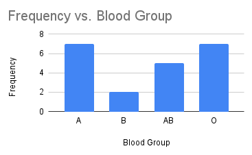
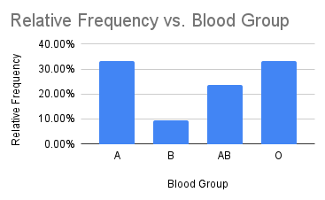
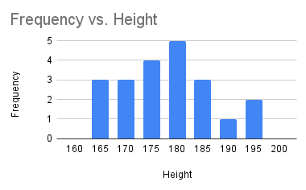
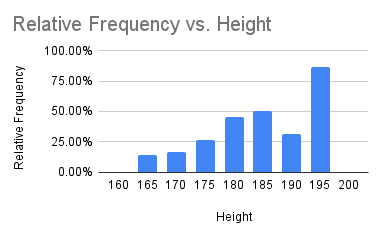

# Section 1.1 - 1.3

We work with a small data set to explain the concepts of [section 1.1 - 1.3](https://stats.libretexts.org/Bookshelves/Introductory_Statistics/Introductory_Statistics_(Shafer_and_Zhang)/01%3A_Introduction_to_Statistics).
*Population* or *sample* is the collection with members in Nickname column. A *measurement* is any data under the rest of the columns. 
Country to travel and Blood Group represent *qualitative/categorical variables* while Height is a *quantitative/numerical*.

| | Nickname   | Next country to travel | Blood Group (A, B, AB, O)	| Height (cm) |
|- | - | - | - | - |
|1| 	Everlyn  | Puerto Rico | B	| 162 |
|2|	Alondra    | Spain       | A	| 162 |
|3|	Aish	     | Mexico	     | A	| 163 |
|4|	Awesome	   | Portugal	   | O	| 170 |
|5|	Andres	   | Japan	     | O	| 170 |

## Steam & Leaf Plot	
|Stem	| Leaf |
| - | - |
|16 |	2 2 3 | 
|17	| 0 0 0 2 5 5 5 7 7 |
|18	| 0 0 0 2 3 3 8 |
|19	| 1 3 |

## Histogram
Now we show the Frequency and Relative Frequency histograms for Blood Gropu and Height.

   

   
